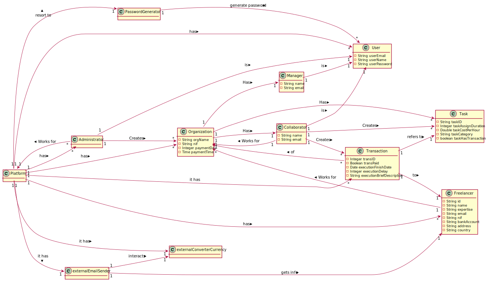

# OO Analysis #
## Rational for identifying domain classes ##

### _Category List_ ###

**Transactions (of business)**

* Transaction

---

**Transaction Lines**

* 

---

**Products related to transactions**

*  Task

---

**Registry (of transactions)**

* Transaction

---  

**Roles**

* Administrator
* Freelancer
* Collaborator
* Manager
* User

---

**Places**

*  Platform

---

**Events**

* 

---

**Physical Objects**

*

---

**Specifications and descriptions**

*  Task
* Transaction
---

**Catalogs**

*

---

**Sets**

* 

---

**Elements of Sets**

*  

---

**Organizations**

*  T4J (Platform)
*  Organization

---

**Other systems (external)**

*  Password Generator
*  External Email Sender
* External Currency Converter

---

**Records (financial), work, contracts, legal documents**

*  Transaction

---

**Financial instruments**

*External Currency Converter

---

**Referred documents / to perform the tasks /**

*

---

## **Rational about identifying associations between classes** ##

| Concept (A) 		|  Association   		|  Concept (B) |
|----------	   		|:-------------:		|------:       |
| Platform | has | Organization |
|  | has | Administrator |
|  | has | Freelancer |
|  | has | User |
|  | has | Transaction |
|  | has | ExternalCurrencyConverter |
|  | has | ExternalEmailSender |
|  | has | PasswordGenerator |
| Administrator | is | User |
|  | creates | Organization |
| Organization | has | Collaborator |
|  | has | Manager |
|  | has | Task |
| Collaborator | is | User |
|  | creates | Task |
| Manager | is | User |
| Transaction | refers to | Task |
|  | to | Freelancer |
|  | of | Organization |
| PasswordGenerator | generate password | User |

## Domain Model

