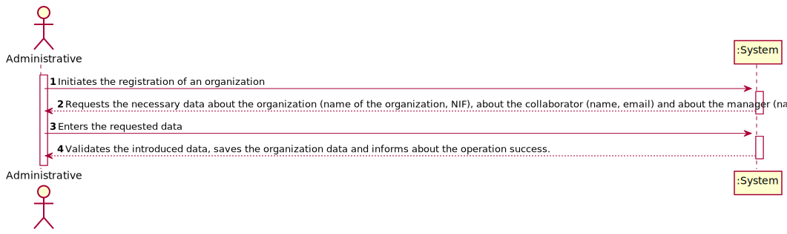
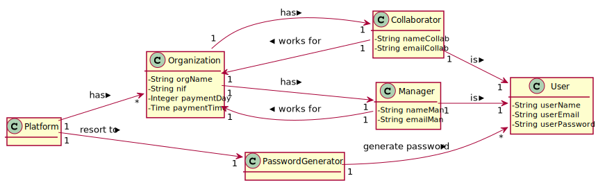
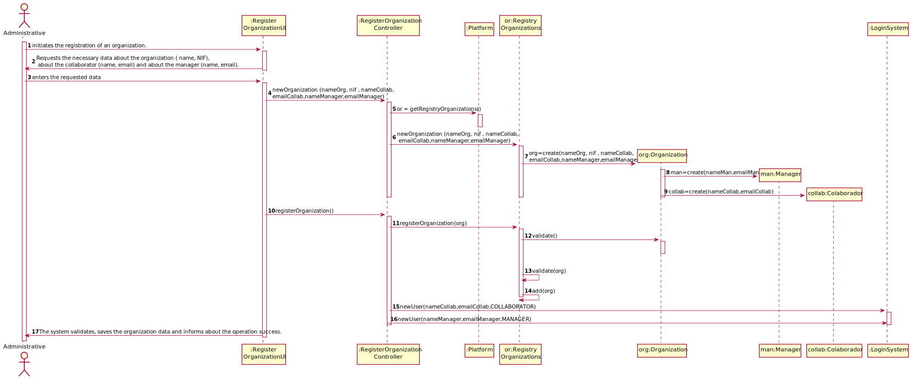
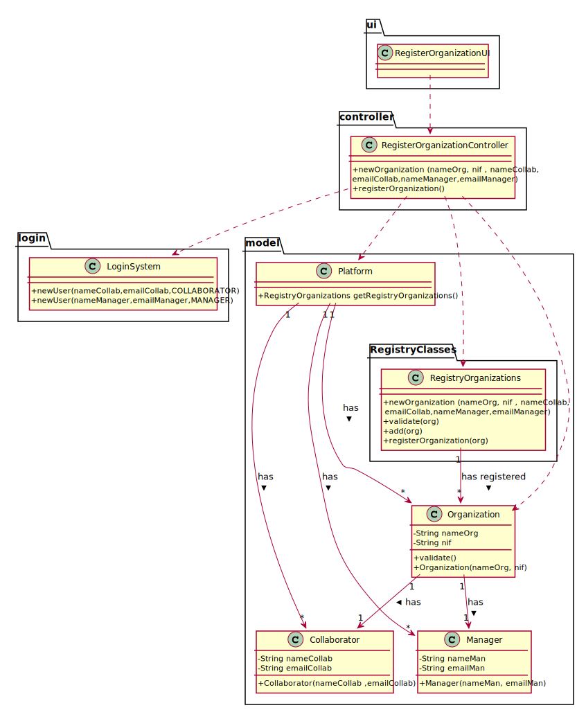

# UC1 - Register Organization

## 1. Requirements Engineering

### Brief Format

The administrative initiates the registration of an organization. 
The system requests the necessary data about the organization ( name, NIF), about the collaborator (name, email) and about the manager (name, email).
The administrator enters the requested data.
The system validates, saves the organization data and informs about the operation success.

 
### SSD

### Full Format

#### Main Actor

* Administrative

#### Stakeholders and their interests
* **Administrative** : Intends to register organizations so that they can use his application.
* **Organization** : Wants to be registered in the application so that they can use it.
* **T4J** : Wants organizations registered in the system, so they can use the application.

#### Preconditions

n/a

#### Post conditions

* The organization's information is stored in the system.
* The manager's information is stored in the system.
* The collaborator's information is stored in the system.
* A user is created on the platform for the Manager.
* A user is created on the platform for the Collaborator.
* An email is sent to the Manager with the access information to the platform.
* An email is sent to the Collaborator with the access information to the platform.

#### Main success scenario (or basic flow)

1. The administrative initiates the registration of an organization. 
2. The system requests the necessary data about the organization ( name, NIF), about the collaborator (name, email) and about the manager (name, email).
3. The administrator enters the requested data.
4. The system validates, saves the organization data and informs about the operation success.

#### Extensions (or alternative flows)
* a. The Administrative cancels the process.

> The process of Register Organization ends.
                                            
* 4a. Missing minimum required data.
>     1. The system informs which data is missing.
>     2. The system allows to enter the missing data (step 3)
>
      >  2a. The administrative does not change the data. The use case ends.

* 4b. The system detects that the email entered must be unique and that it already exists in the system.
>     1. The system alerts the administrative to the fact.
>     2. The system allows to change it (step 3)
>
      >  2a. The administrative does not change the data. The use case ends.

#### Special requirements
- The manager's password is generated by an external algorithm.

#### List of Technologies and Data Variations
\-

#### Frequency of Occurrence
\-

#### Open questions

* Are there any other mandatory data in addition to those already known?

## 2. OO Analysis.

### Excerpt from the Relevant Domain Model for UC

## 3. Design - Use Case Realization

### Rational

| Main Flow | Question: What Class... | Answer  | Justification  |
|:--------------  |:---------------------- |:----------|:---------------------------- |
|1. The administrative initiates the registration of an organization. |... interacts with the user?| RegisterOrganizationUI |IE:Pure Fabrication|
| |... coordinates the UC?| RegisterOrganizationController|IE: Controller|
| |... has RegistryOrganizations?| Platform |IE: Platform has RegistryOrganizations|
| |... creates instances of Organization?|RegistryOrganizations|IE:By applying HC + LC to the “Platform", this delegates the responsibility to “RegistryOrganizations".|
|2. The system requests the necessary data about the organization ( name, NIF), about the collaborator (name, email) and about the manager (name, email).||||
|3. The administrator enters the requested data. |... saves the entered data?|Organization, Manager, Collaborator|IE: instance created in step 1|
| |... creates instances of Manager?|Organization|creator(rule1)|
| |... creates instances of Collaborator?|Organization|creator(rule1)|
|4. The system validates, saves the organization data and informs about the operation success. |... validates the Organization's data (local validation)|Organization|IE: has its own data|
| |... validates the Manager's data (local validation)|Manager|IE: has its own data|
| |... validates the Collaborator's data (local validation)|Collaborator|IE: has its own data|
| |... validates the Organization's data (global validation)|RegistryOrganizations|IE:RegistryOrganizations has registered Organization|
| |... generates the password? | PasswordGenerator | Protected Variation|
| |... registers / keeps the User regarding the Organization's Collaborator/Manager?|RegistryUsers|By applying HC + LC to the Platform|
| |... sends the manager/collaborator email?|LoginSystem|IE: holds the necessary information.|

             

### Systematization ##

 It follows from the rational that the conceptual classes promoted to software classes are:

 * Platform
 * Organization
 * Collaborator
 * Manager
 * PasswordGenerator
 * LoginSystem

Other software classes (i.e. Pure Fabrication) identified: 

 * RegisterOrganizationUI  
 * RegisterOrganizationController
 * RegistryOrganizations
 * RegistryUsers

###	Sequence Diagram

###	Class Diagram

