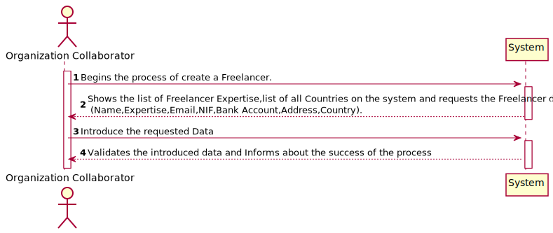
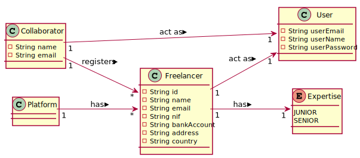
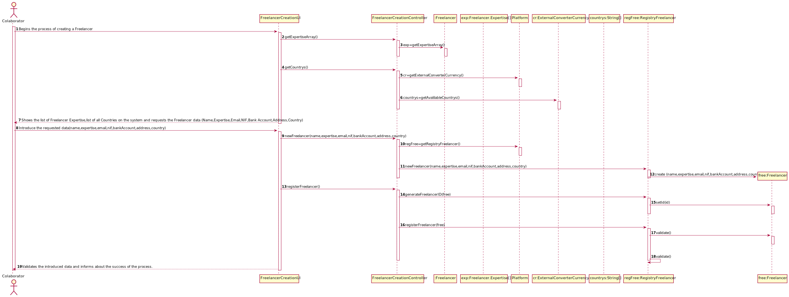
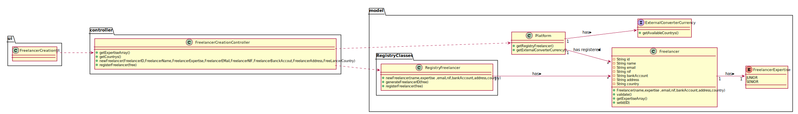

# UC10 - Freelancer Creation

## 1. Requirements Engineering

### Brief Format

The collaborator begins the process of create a Freelancer. The system shows the list of Freelancer Expertise,list of all Countries on the system and requests the Freelancer data  (Name,Expertise,Email,NIF,Bank Account,Address,Country).
The collaborator introduces the requested data and confirms to create the Freelancer. The system validates the data introduced and informs of the success of the operation . 

#### Main Actor

* Collaborator

#### Stakeholders and their interests
* **Collaborator** : Wants to register Freelancer in the system.
* **Freelancer** : Wants to be registered to get paid.
* **T4J** : Wants to have freelancers registered on the system , so they can get paid by their work.
#### Preconditions

#### Post conditions

* A Freelancer gets registered on the system .

#### Main success scenario (or basic flow)

1. The collaborator begins the process of create a Freelancer.
2. The system shows the list of Freelancer Expertise,list of all Countries on the system and requests the Freelancer data (Name,Expertise,Email,NIF,Bank Account,Address,Country).
3. The collaborator introduces the requested Data.
4. The system validates the introduced data and informs about the success of the process. 

#### Extensions (or alternative flows)
* a. The Collaborator cancels the process.
>
    > The process of creation of a Freelancer ends.
                                            
* 4a. The data introduced is invalid .
> 
      > The system allows to change the data.
          > 2a. The collaborator doesn't introduce valid data about the Freelancer. The unique case ends.
         
#### Special requirements
\-

#### List of Technologies and Data Variations
\-

#### Frequency of Occurrence
\-

#### Open questions
\-
## 2. OO Analysis

### Excerpt from the Relevant Domain Model for UC

## 3. Design - Use Case Realization

### Racional

| Main Flow | Question: What Class ... | Answer | Justification  |
|:--------------  |:---------------------- |:----------|:---------------------------- |
|1. The collaborator begins the process of create a Freelancer. | ... interact with the Freelancer? | RegisterFreelancerUI |IE:Pure Fabrication|
| | ... coordinates the UC? | RegisterFreelancerController | IE:Controller. | 
| | ... creates the Freelancer ? | RegistryFreelancer |IE: Has Freelancers registered. |
| |...has RegistryFreelancer? |Platform | IE: Has RegistryFreelancer.|
|2.The system shows the list of Freelancer Expertise,list of all Countries on the system and requests the Freelancer data (Name,Expertise,Email,NIF,Bank Account,Address,Country).|...has Freelancer Expertise | Freelancer | IE: Freelancer has Expertise.|
| |... has list of all countries in the system?|ExternalConverterCurrency| IE: ExternalConverterCurrency has information about every country available.|   
|3. The collaborator introduces the requested Data. |...saves this information ? | Freelancer | IE: Freelancer knows his data.|
|4. The system validates the introduced data and informs about the success of the process.| ...validates the data of Freelancer(local validation)? |  Freelancer. |IE: Has its own data.| 
| | ...validates the data of Freelancer(Global Validation)?| RegistryFreelancer | IE : By pattern HC+LC this task is delegated by the Platform.|    
| | ... saves the Freelancer? | RegistryFreelancer | IE: has Freelancers .|

 
### Systematization ##

It follows from the rational that the conceptual classes promoted to software classes are:
 * Freelancer 
 * Platform
 Other software classes (i.e. Pure Fabrication) identified: 
 * RegistryFreelancer
 * FreelancerCreationUI
 * FreelancerCreationController

###	Sequence Diagram

###	Class Diagrams

