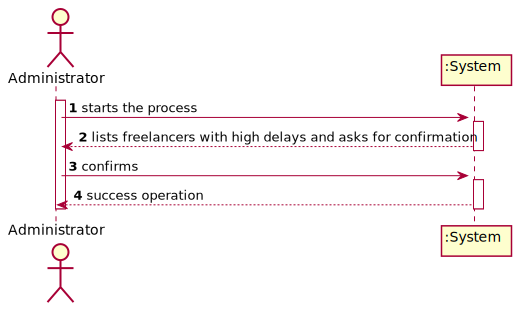
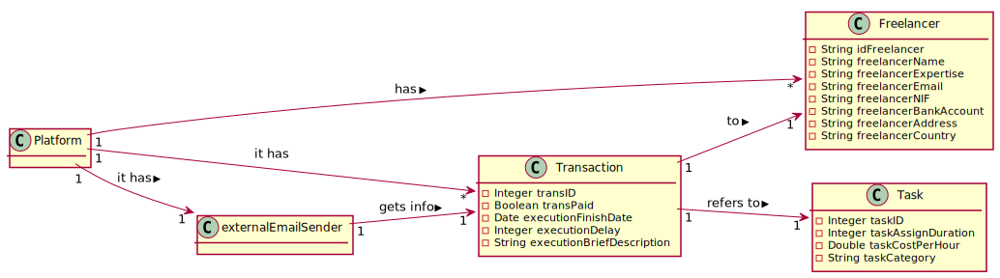
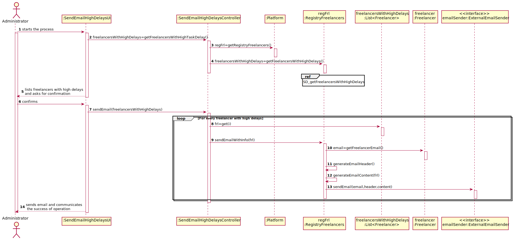
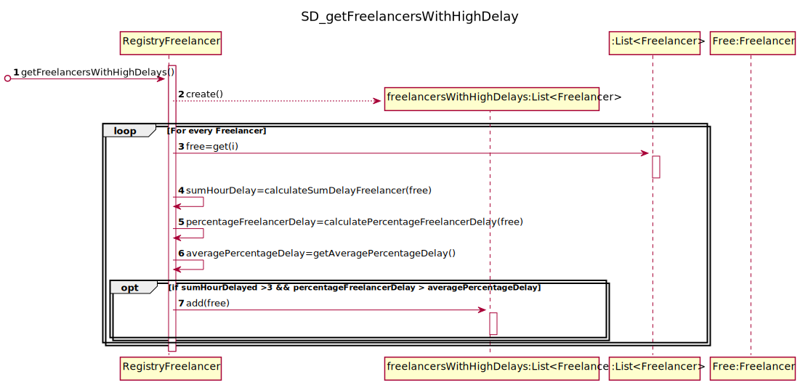
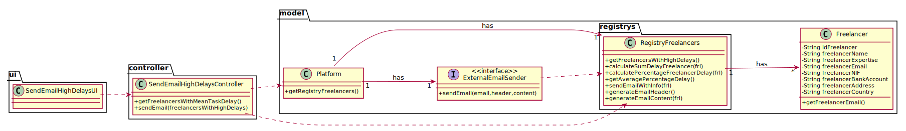

# UC11 - Send email to freelancers with high delays

## 1. Requirements Engineering

### Brief Format

The administrator starts the process of sending email to freelancers with high delays. The system lists the freelancers with high delays in the current year and asks for confirmation. The administrator confirms. The system sends email to the specified freelancers and communicates the success of the operation.

### SSD

### Full Format

#### Main Actor

* Administrator

#### Stakeholders and their interests
* **Administrator** : Wants to send email to freelancers with high delays.
* **T4J** : Wants to warn freelancers with high delays.
* **Freelancer** : Wants to be notified when having high delays in 

#### Preconditions

* There must be registered freelancers.

#### Post conditions

* Email is sent.

#### Main success scenario (or basic flow)

1. The administrator starts the process of sending email to freelancers with high delays in the current year.
2. The system lists the freelancers with high delays in the current year and asks for confirmation.
3. The administrator confirms.
4. The system sends email to the specified freelancers and communicates the success of the operation.

#### Extensions (or alternative flows)

*a. The administrator cancels the process.
>	The use case ends.

#### Special requirements
\-

#### List of Technologies and Data Variations
\-

#### Frequency of Occurrence
\-

#### Open questions

- 

## 2. OO Analysis

### Excerto do Modelo de Domínio Relevante para o UC

## 3. OO Design

### Racional

| Main Scenario | Question: Which class... | Answer  | Justification  |
|:--------------  |:---------------------- |:----------|:---------------------------- |
| 1. The administrator starts the process of sending email to freelancers with high delays in the current year. | ... interacts with the user? | SendEmailHighDelaysUI | Pure Fabrication |
|  | ... coordinates the UC? | SendEmailHighDelaysController | Controller |
| 2. The system lists the freelancers with high delays in the current year and asks for confirmation. | ... knows the freelancers wanted? | Platform | IE: by HC+LC, the responsabilities about Freelancers goes to RegistryFreelancers. |
|  |  | RegistryFreelancers | IE: have all Freelancers. |
| 3. The administrator confirms. |  |  |  |
| 4. The system sends email to the specified freelancers and communicates the success of the operation. | ... sends email to the freelancers? | RegistryFreelancers | IE: have all freelancers. |

### Systematization ##

 From racional results the following software classes:

 * Platform
 * Freelancer

Another classes (IE: Pure Fabrication) identified:  

 * SendEmailHighDelaysUI
 * SendEmailHighDelaysController
 * RegistryFreelancers

###	Sequence Diagram

###	Class Diagram

