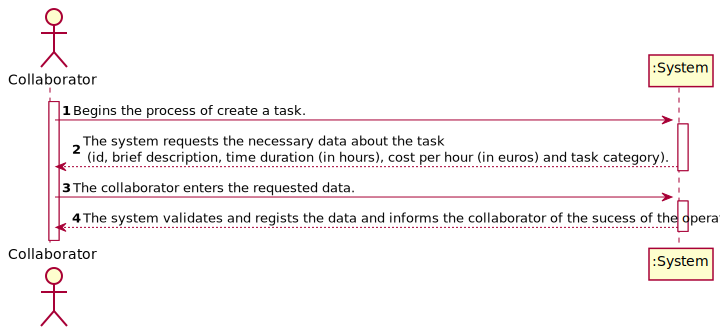
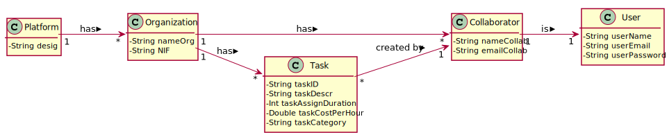
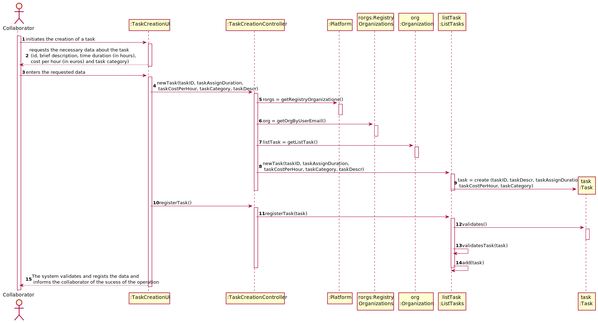
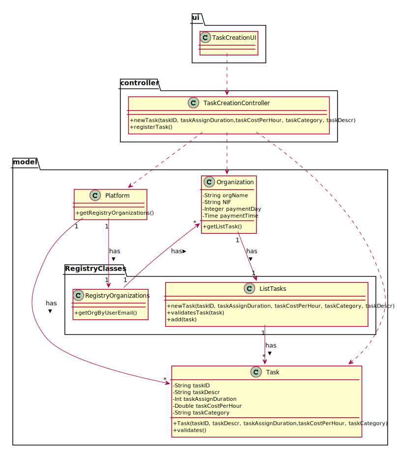

# UC2 - Task Creation

## 1. Requirements Engineering

### Brief Format

The collaborator initiates the creation of a task. 
The system requests the necessary data about the task (id, brief description, time duration (in hours), cost per hour (in euros) and task category).
The collaborator enters the requested data.
The system validates and regists the data and informs the collaborator of the sucess of the operation.
 
### SSD

### Full Format

#### Main Actor

* Collaborator

#### Stakeholders and their interests
* **Collaborator** : wants to create tasks.
* **Organization** : wants tasks to be registered in the system.
* **T4J** : wants tasks to be created to ensure the smooth running of the application.

#### Preconditions

n/a

#### Post conditions

* The information for the new task is recorded in the system.

#### Main success scenario (or basic flow)

1. The collaborator initiates the creation of a task.
2. The system requests the necessary data about the task (id, brief description, time duration (in hours), cost per hour (in euros) and task category). 
3. The collaborator enters the requested data.
4. The system validates and regists the data and informs the collaborator of the sucess of the operation

#### Extensions (or alternative flows)
* a. The Collaborator cancels the process.

> The process of creating a task ends.
                                            
* 4a. Missing minimum required data.
>     1. The system informs which data is missing.
>     2. The system allows to enter the missing data (step 3)
>
      >  2a. The collaborator does not change the data. The use case ends.

* 4b. 
The system detects that the data entered (or some subset of the data) is invalid.
>     1. The system alerts the collaborator to the fact.
>     2. The system allows to change it (step 3)
>
      >  2a. The collaborator does not change the data. The use case ends.

#### Special requirements
\-

#### List of Technologies and Data Variations
\-

#### Frequency of Occurrence
\-

#### Open questions

* How often does this use case occur?

## 2. OO Analysis

### Excerpt from the Relevant Domain Model for UC

## 3. Design - Use Case Realization

### Rational

| Main Flow | Question: What Class... | Answer  | Justification  |
|:--------------  |:---------------------- |:----------|:---------------------------- |
|1.The collaborator initiates the creation of a task.  |... interacts with the user?| TaskCreationUI |IE: Pure Fabrication|
| |... coordinates the UC?| TaskCreationController |IE: Controller|
| |... creates instances of Task?|ListTasks|IE: By applying HC + LC to the “Platform", this delegates that responsibility to “ListTasks".|
| |... knows the user/collaborator using the system?|LoginSystem|IE : LoginSystem knows the logged user.|
| |... knows which organization the user / collaborator belongs to?|RegistryOrganizations|IE : knows all organizations.|
| | |Organization|IE : knows his collaborators.|
| | |Collaborator|IE : he knows his own data (e.g. email).|
|2.The system requests the necessary data about the task (id, brief description, time duration (in hours), cost per hour (in euros) and task category). ||||
|3. The collaborator enters the requested data |... saves the entered data?|Task|IE: Task has his own data.|
|4. The system validates and regists the data and informs the collaborator of the sucess of the operation |... validates the Task's data (local validation)|Task|IE: has its own data|
| |... validates the Task's data (global validation)|ListTasks|IE: ListTasks has Task.|
| |... saves the created Task?| ListTasks |IE: ListTaks has Task.|

             

### Systematization ##

 It follows from the rational that the conceptual classes promoted to software classes are:

* Organization
* Platform
* Task

Other software classes (i.e. Pure Fabrication) identified: 

* TaskCreationUI
* TaskCreationController
* ListTasks
* RegistryOrganizations
Other classes of external systems / components:

* LoginSystem

###	Sequence Diagram

###	Class Diagram

