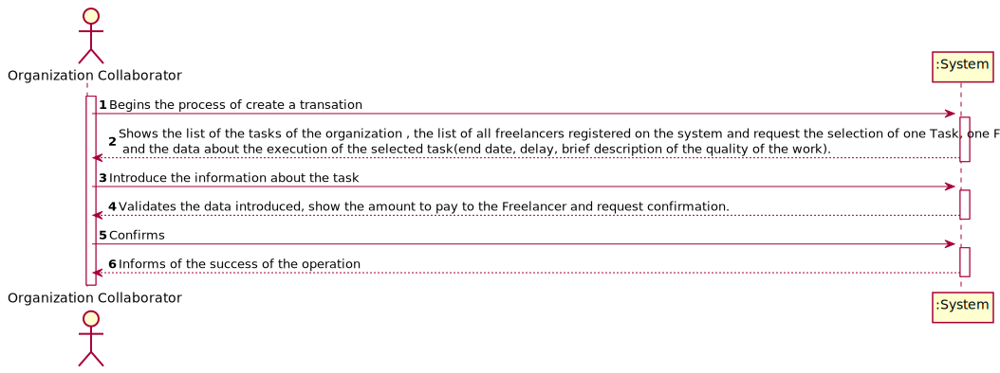
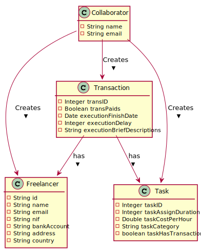
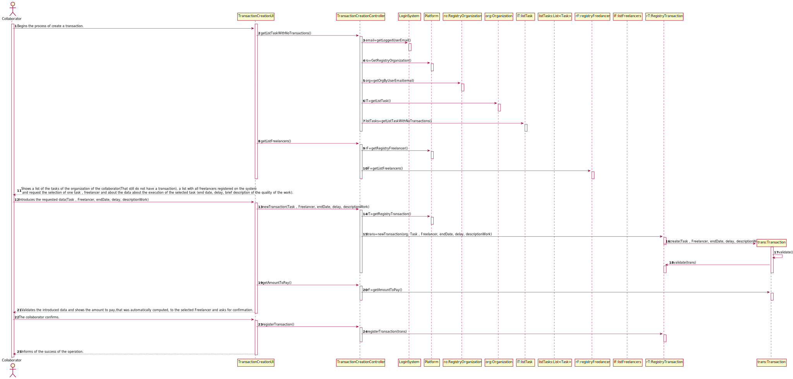
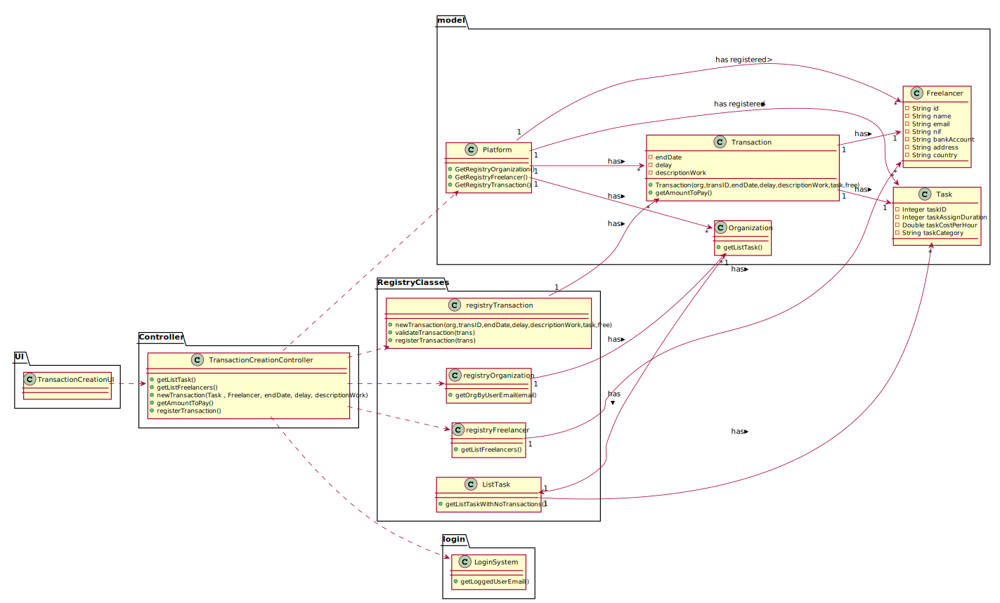

# UC3 - Transaction Creation

## 1. Requirements Engineering

### Brief Format

The collaborator begins the process of create a payment transaction. The system shows a list of the tasks of the organization(That still do not have a transaction), a list with all freelancers registered on the system and request the selection of one task , freelancer and
about the data about the execution of the selected task (end date, delay, brief description of the quality of the work).
The collaborator introduces the requested data(Task , Freelancer, end date, delay, brief description of the quality of the work).
The system shows the amount to pay,that was automatically computed, to the selected Freelancer and asks for confirmation.
The collaborator confirms. The system informs of the success of the operation.

### Full Format

#### Main Actor

* Collaborator

#### Stakeholders and their interests

* **Collaborator** : wants to process transactions of the organization.
* Organization : Wants to process the money to pay the Freelancer that did the task of the organization.
* Freelancer : Wants to get the money for his work.

#### Preconditions

* The organization has tasks (that still do not have transaction) registered in the system.
* The system has at least one Freelancer registered on the system.

#### Post conditions

* A payment transaction gets registered on the system .

#### Main success scenario (or basic flow)

1. The collaborator begins the process of create a transaction.
2. The system shows a list of the tasks of the organization of the collaborator(That still do not have a transaction), a list with all freelancers registered on the system and request the selection of one task , freelancer and
   about the data about the execution of the selected task (end date, delay, brief description of the quality of the work).
3. The collaborator introduces the requested data(Task , Freelancer, end date, delay, brief description of the quality of the work).
4. The system validates the introduced data and shows the amount to pay,that was automatically computed, to the selected Freelancer and asks for confirmation.
5. The collaborator confirms.
6. The system informs of the success of the operation.
#### Extensions (or alternative flows)
* a. The Collaborator cancels the process.
>
    > The process of Transaction Creation ends.
                                            
* 2a. The Collaborator does not find the task that he wants.
 >
      1. The system allows about the creation of a new task(UC2).
          > 2a. The collaborator doesn't introduce new data. The unique case ends.

* 2a. The Collaborator does not find the Freelancer that he wants .
> 
      > The system allows about the creation of a new Freelancer(UC10).
          > 2a. The collaborator doesn't introduce new data about the Freelancer. The unique case ends.

* 3a. The Collaborator introduce invalid data.
> 
    >1.The system alerts for the fact and allows the collaborator to edit.
        >2a. The collaborator doesn't introduce new data. The unique case ends.

* 5a. The Collaborator doesn't confirm.
 > 
    >   The system allows to edit the existing data. 
         

#### Special requirements
\-

#### List of Technologies and Data Variations
\-

#### Frequency of Occurrence
\-

#### Open questions

* What happens when the collaborator disagrees with the value calculated by the system ?

## 2. OO Analysis

### Excerpt from the Relevant Domain Model for UC

## 3. Design - Use Case Realization

### Racional

| Main Flow | Question: What Class ... | Answer | Justification  |
|:--------------  |:---------------------- |:----------|:---------------------------- |
|1. The collaborator begins the process of create a transaction. | ... interact with the Collaborator? | RegisterTransactionUI |IE:Pure Fabrication|
| | ... coordinates the UC? | TransactionCreationController | IE:Controller. | 
| | ... creates the Transaction ? | RegistryTransactions |IE: Has Transactions registered. |
| |... has RegistryTransactions|Platform | IE: Has RegistryTransactions.|  
| | ... knows the user logged in? | UserSession | IE: knows the information about the user logged in. |
|2. The system shows a list of the tasks of the organization of the collaborator(That still do not have a transaction), a list with all freelancers registered on the system and request the selection of one task , freelancer and about the data about the execution of the selected task (end date, delay, brief description of the quality of the work).| ...has the list of the tasks of the Organization | Organization | IE: Organization has list of Tasks |
| |...has a Task | listTasks|IE: ListTasks has tasks.| 
| |...has Organization| RegistryOrganization |IE: By pattern HC+LC this task is delegated by the Platform|
| |...has RegistryOrganization | Platform | IE : Has RegistryOrganization. |
| |...has all Freelancers | Registry Freelancers|IE: By pattern HC+LC this task is delegated by the Platform.|
| |...has RegistryFreelancer| Platform| IE: Has RegistryFreelancer.| 
|3. The collaborator introduces the requested data(Task , Freelancer, end date, delay, brief description of the quality of the work). | ... saves the data introduced ?| Transaction | IE: A Transaction has a Task,Freelancer and data about the execution of the task(end date, delay, brief description of the quality of the work.) |
|4. The system validates the introduced data and shows the amount to pay,that was automatically computed, to the selected Freelancer and asks for confirmation.| ... calculated the amount to pay |  Transaction | IE: Transaction have a method that calculate the amount.|
| |...validates the data of Transaction(local validation)? | Transaction | IE: Has its own data.|
| | ...validates the data of Transaction(Global Validation)?| RegistryTransaction | IE : By pattern HC+LC this task is delegated by the Platform.| 
|5. The collaborator confirms.| ... Registers the Transaction | RegistryTransaction | IE: has Transactions .|
|6. The system informs of the success of the operation.
### Systematization ##

It follows from the rational that the conceptual classes promoted to software classes are:
 * Transaction
 * Freelancer 
 * Task
 * Platform
 Other software classes (i.e. Pure Fabrication) identified: 
 * RegistryTransaction
 * TransactionCreationUI
 * TransactionCreationController

###	Sequence Diagram

###	Class Diagram

