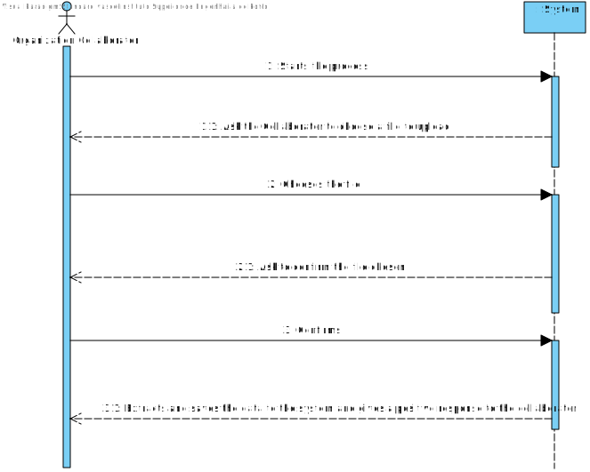
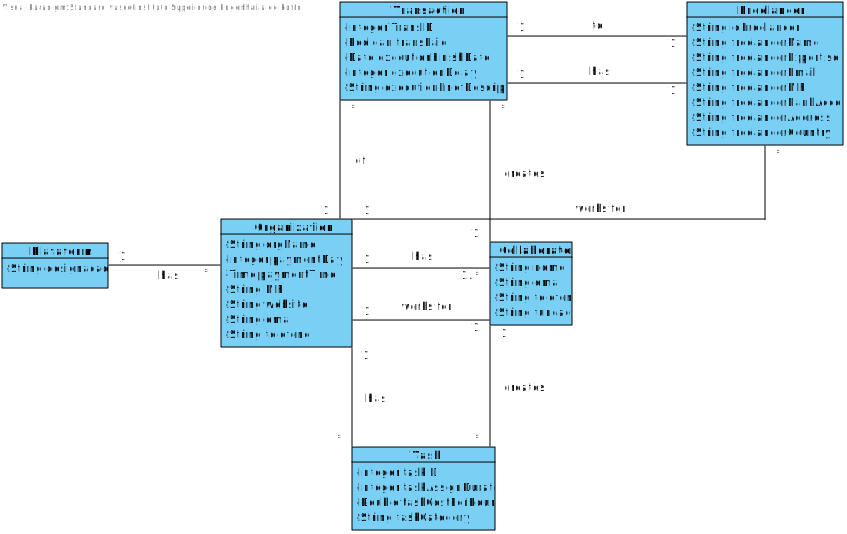
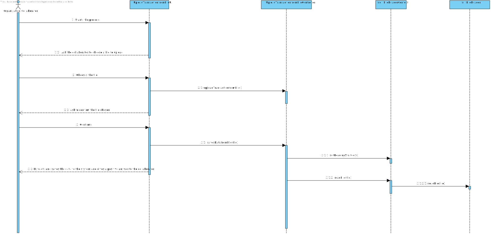
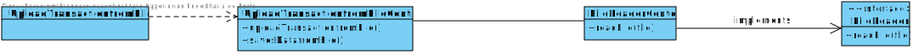

# UC4 - Upload Transaction from File

## 1. Requirements Engineering

### Brief Format
 The collaborator starts the opperation. The sistem ask to the collaborator to choose a file to upload the data. The collaborator chooses the file. The system ask to confirm the file chosen. The collaborator confirms. The sistem extracts and saves the data to the system and gives a positive response to the collaborator. 

### SSD

### Full Format

#### Main Actor

* Collaborator

#### Stakeholders and their interests
* **Collaborator** : Wants to upload the file to have some data about specific transactions.
* **Organization** : Wants to have the data of the transactions.
* **T4J** : Wants to keep some data about past transactions. 

#### Preconditions

* There needs to have some past payments to the freelancers.
* The Organization needs to have at least one task completed.

#### Post conditions

  -

#### Main success scenario (or basic flow)

1. The collaborator starts the opperation.
2. The sistem ask to the administrator to choose a file to upload the data.
3. The collaborator chooses the file.
4. The system ask to confirm the file chosen.
5. The collaborator confirms.
6. The sistem extracts and saves the data to the system and gives a positive response to the collaborator.

#### Extensions (or alternative flows)
* *a. The Collaborator cancels the process.
   > 
     > The process of Transaction Creation ends.
                                            
* 3a. The Collaborator doesn't choose a file.
   >
    > The system alerts the collaborator about the occurrence.
    >
     > The system allows the Collaborator to choose again.
     >
      > 2a.
      >
      > The collaborator doesn't choose a file. The unique case ends.

#### Special requirements
\-

#### List of Technologies and Data Variations
\-

#### Frequency of Occurrence
\-

#### Open questions

* Exists some kind of verification on the files so there isnt anything but transaction related?

## 2. OO Analysis

### Excerpt from the Relevant Domain Model for UC

## 3. Design - Use Case Realization

### Rational

| Main Flow | Question: What Class ... | Answer  | Justification  |
|:--------------  |:---------------------- |:----------|:---------------------------- |
|1. The collaborator starts the opperation.|...interacts with the collaborator?| UploadTransactionfromFileUI |Pure Fabrication|
| |... coordena o UC?| UploadTransactionfromFileController |Controller|
| |...keeps the data requested?| Organization | IE: in the MD Organization aggregates Task,Freelancer and Transaction.|
|2. The sistem ask to the administrator to choose a file to upload the data.||||
|3. The collaborator chooses the file. |...saves the file with the data ?| Task,Transaction,Freelancer |IE: has its own data |
|4.The system ask to confirm the file chosen.| ...validates the data on the file?(local validation)|Freelancer|IE: has its own data |
| ||Task|IE: has its own data |
| ||Transaction|IE: has its own data |
| |... validates the data on the file?(global validation)|Plataforma|IE: In the MD Plataform aggregates Freelancer,Task and Transaction|
|5. The collaborator confirms. ||||
|6. The sistem extracts and saves the data to the system and gives a positive response to the collaborator.|...keeps the data?| Organization |IE: in the MD Organization aggregates Task,Freelancer and Transaction.|

             

### Systematization ##

 It follows from the rational that the conceptual classes promoted to software classes are:

 * FileReaderContext
 * FileReader

Other classes of software (i.e. Pure Fabrication) identified:  

 * UploadTransactionfromFileUI  
 * UploadTransactionfromFileController

###	Sequence Diagram

###	Class Diagram

