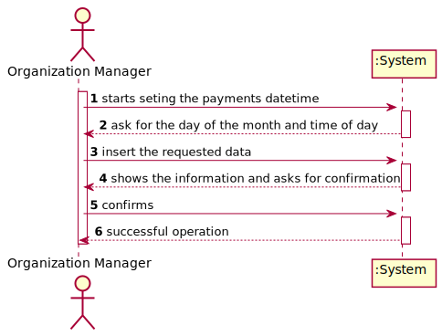
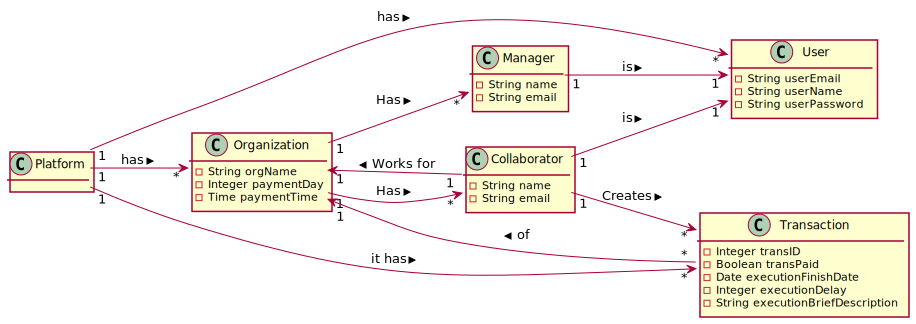
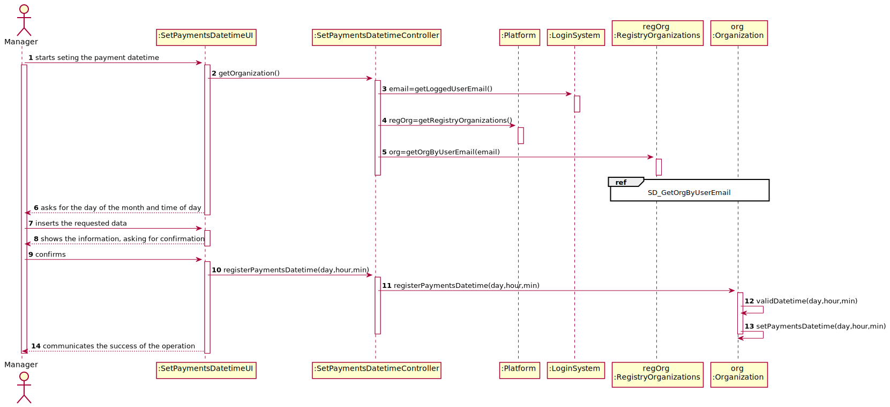
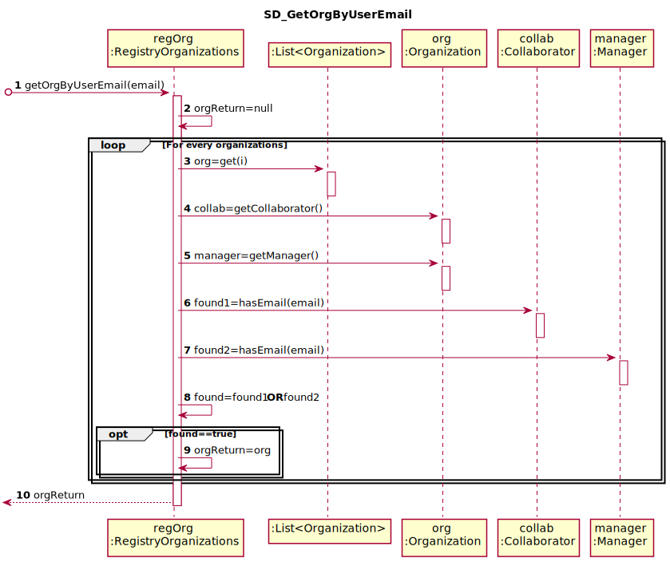
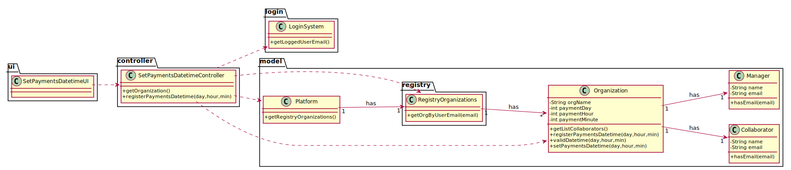

# UC5 - Set Payments Datetime

## 1. Requirements Engineering

### Brief Format

The organization manager starts seting the payments datetime. The system asks for the day of the month and time of day intended to pay. The manager inserts the requested data. The system shows the information and asks for confirmation. The manager confirms. The system saves the datetime and communicates the success of the operation.

### SSD

### Full Format

#### Main Actor

* Organization Manager

#### Stakeholders and their interests
* **Manager** : Wants to set the datetime of the payments.
* **Organization** : Wants to make the payments at a certain datetime.

#### Preconditions

(n/a)

#### Post conditions

* The payment datetime stays defined.

#### Main success scenario (or basic flow)

1. The organization manager starts seting the payments datetime.
2. The system asks for the day of the month and time of day intended to pay.
3. The manager inserts the requested data.
4. The system validates and shows the information, asking for confirmation.
5. The manager confirms.
6. The system saves the datetime and communicates the success of the operation.

#### Extensions (or alternative flows)
*a. The manager cancels the process.
>	The use case ends.
                                            
4a. The manager introduces an invalid day or time.
>	The system alerts the user and lets him change. (Step 3)

#### Special requirements
\-

#### List of Technologies and Data Variations
\-

#### Frequency of Occurrence
\-

#### Open questions

- Does the day of the month have a limit of 28, being the last day common to all months?
- What is the default datetime specified?

## 2. OO Analysis

### Excerto do Modelo de Domínio Relevante para o UC

## 3. OO Design

### Racional

| Main Scenario | Question: Which class... | Answer  | Justification  |
|:--------------  |:---------------------- |:----------|:---------------------------- |
| 1. The organization manager starts seting the payments datetime. | ... interacts with the user? | SetPaymentsDatetimeUI | Pure Fabrication |
|  | ... coordinate the UC? | SetPaymentDatetimeController | Controller |
|  | ... knows the user logged in? | UserSession | IE: knows the information about the user logged in. |
|  | ... keeps the data requested? | Platform | IE: relegates the responsabilities about Organizations to RegistryOrganizations. |
|  |  | RegistryOrganizations | IE: it has all Organizations. |
|  |  | Organization | IE: knows its own data. |
| 2. The system asks for the day of the month and time of day intended to pay. |  |  |  |
| 3. The manager inserts the requested data. |  |  |  |
| 4. The system validates and shows the information, asking for confirmation. | ... does the verification? | Organization | IE: knows its own data. |
| 5. The manager confirms. |  |  |  |
| 6. The system saves the datetime and communicates the success of the operation. | ... saves the datetime of the payments? | Organization | IE: knows its own data. |

### Systematization ##

 From racional results the following software classes:

 * Platform
 * Organization

Another classes (IE: Pure Fabrication) identified:  

 * SetPaymentsDatetimeUI  
 * SetPaymentsDatetimeController
 * RegistryOrganization

External Components:

 * LoginSystem

###	Sequence Diagram

###	Class Diagram

