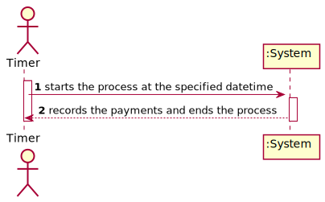
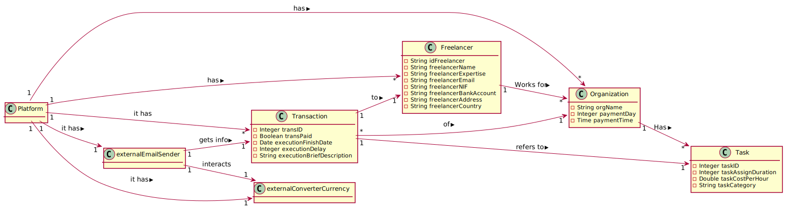
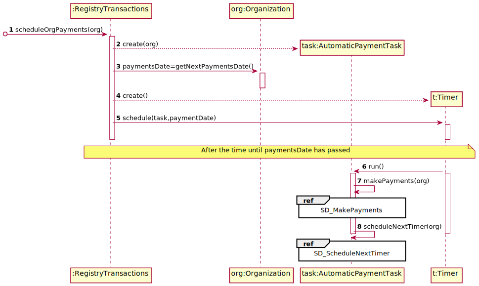
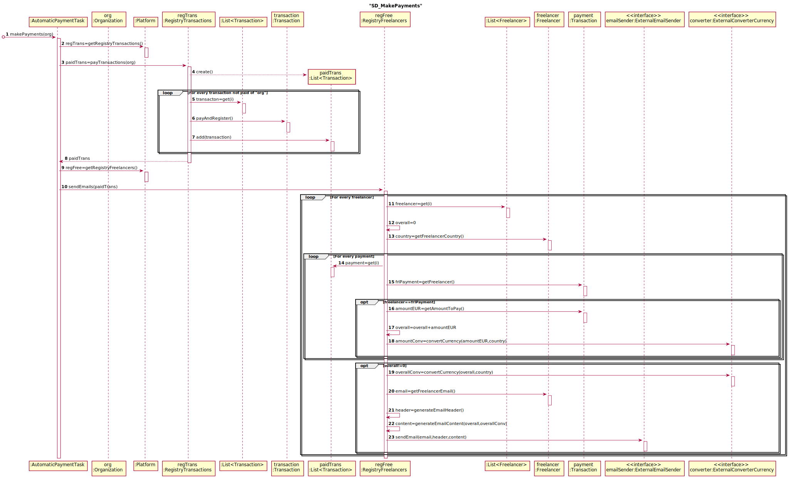
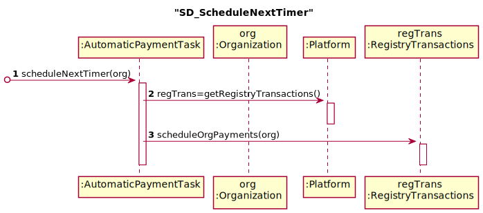
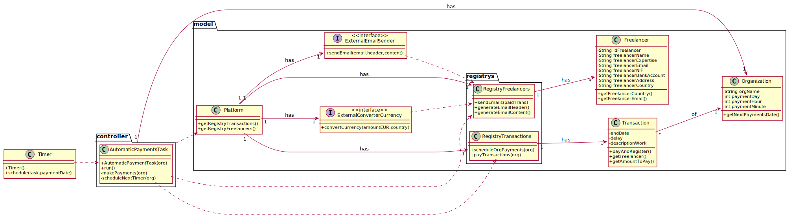

# UC6 - Automatic Payments

## 1. Requirements Engineering

### Brief Format

The process starts the process at the specified datetime. The system records the payments and ends the process.

### SSD

### Full Format

#### Main Actor

* Timer

#### Stakeholders and their interests
* **Organization** : Wants to make the payments to freelancers.
* **Freelancer** : Wants to be paid.
* **T4J** : Wants payments to be made.

#### Preconditions

* There must be a datetime defined to the payments.

#### Post conditions

* The payments' informations are recorded.

#### Main success scenario (or basic flow)

1. The timer starts the payments process at the specified datetime to the organization.
2. The system makes and records the payments and ends the process.

#### Extensions (or alternative flows)
2a. The transaction is already paid.
>	The use case ends.

#### Special requirements
\-

#### List of Technologies and Data Variations
\-

#### Frequency of Occurrence
\-

#### Open questions

- 

## 2. OO Analysis

### Excerto do Modelo de Domínio Relevante para o UC

## 3. OO Design

### Racional

| Main Scenario | Question: Which class... | Answer  | Justification  |
|:--------------  |:---------------------- |:----------|:---------------------------- |
| 1. The timer starts the payments process at the specified datetime to the organization. | ... coordinates the UC? | AutomaticPaymentTask | TimerTask |
|  | ... creates the Timer? | RegistryTransactions | Creator: the RegistryTransactions have all the information needed. |
|  | ... knows the time of the next Timer? | Organization | IE: knows its own data. |
|  | ... identifies that time has been reached and starts the process? | Timer | Timer |
| 2. The system makes and records the payments and ends the process. | ... knows the Transactions? | Platform | IE: have RegistryTransactions. |
|  |  | RegistryTransactions | IE: have all Transactions (by HC+LC). |
|  | ... knows if a transaction is already paid and belongs to the specified Organization? | Transaction | IE: knows its own data. |
|  | ... register payments in text file? | Transiction | IE: knows its own data. |
|  | ... knows the Freelancers? | Platform | IE: have RegistryFreelancers. |
|  |  | RegistryFreelancers | IE: have all Freelancers (by HC+LC). |
|  | ... sends email to the freelancer? | ExternalEmailSender | Protected Variation |
|  | ... converts payment amount to freelancers country currency? | ExternalConverterCurrency | ProtectedVariation |

### Systematization ##

 From racional results the following software classes:

 * Platform
 * Organization
 * Transaction

Another classes (IE: Pure Fabrication) identified:  

 * AutomaticPaymentTask
 * Timer
 * RegistryTransactions
 * RegistryFreelancers

External Components:

 * ExternalEmailSender
 * ExternalConverterCurrency

###	Sequence Diagram

###	Class Diagram

