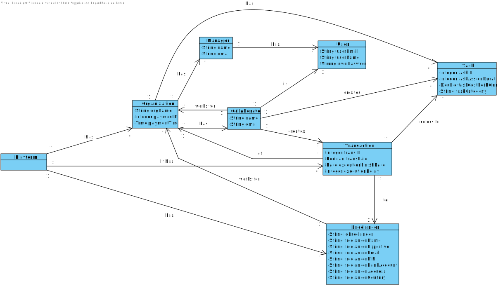

# UC7 - Stats about Freelancer in Organization

## 1. Requirements Engineering

### Brief Format
  

### SSD

### Full Format

#### Main Actor

* Collaborator/Manager

#### Stakeholders and their interests
* **Collaborator/Manager** : Wants to see any specific data about one or more freelancers.
* **Organization** : Wants to know the statistics about the freelancer working for them.

#### Preconditions

* There needs to have at least one Task done by freelancers.

#### Post conditions

  -

#### Main success scenario (or basic flow)

1. The collaborator/manager starts the opperation.
2. The sistem shows the list of freelancers.
3. The collaborator/manager chooses a freelancer.
4. The system ask to confirm the freelancer chosen.
5. The collaborator/manager confirms.
6. The sistem creates the statistics about the freelancer in comparison with the mean,standard deviation and the histogram of both execution times and freelancer payments.

#### Extensions (or alternative flows)
* *a. The Collaborator/Manager cancels the process.
   > 
     > The process of showing the statistics of a Freelancer ends.
                                            
* 3a. The Collaborator/Manager doesn't choose a Freelancer.
   >
    > The system alerts the collaborator about the occurrence.
    >
     > The system allows the Collaborator/Manager to choose again.
     >
      > 2a.
      >
      > The Collaborator/Manager doesn't choose a Freelancer. The unique case ends.

#### Special requirements
\-

#### List of Technologies and Data Variations
\-

#### Frequency of Occurrence
\-

#### Open questions

* There are any more data needed to show?

## 2. OO Analysis

### Excerpt from the Relevant Domain Model for UC

## 3. Design - Use Case Realization

### Rational

| Main Flow | Question: What Class ... | Answer  | Justification  |
|:--------------  |:---------------------- |:----------|:---------------------------- |
|1. The collaborator/manager starts the opperation.|...interacts with the collaborator/manager?| UploadTransactionfromFileUI |Pure Fabrication|
| |... is in charge of the UC?| UploadTransactionfromFileController |Controller|
| |...knows the user is logged in?| UserSession | IE: knows the information about the user logged in. |
|2.The sistem shows the list of freelancers.| ...knows the freelancers | Platform| IE: int the MD Platform has Freelancers|
||| ListFreelancers |IE: in the MD Platform has Freelancers.By aplication of HC+LC delegates ListFreelancers.|
|3. The collaborator/manager chooses a freelancer. |...saves the Freelancer?| Platform |IE: in the MD Platform has Freelancers |
|4.The system ask to confirm the freelancer chosen.| ...validates the data of the Freelancer?(local validation)|Freelancer|IE: has its own data |
| |... validates the data of the Freelancer?(global validation)|ListFreelancer|IE: in the MD Platform has Freelancers.By aplication of HC+LC delegates ListFreelancers.|
|5. The collaborator/manager confirms. ||||
|6. The sistem creates the statistics about the freelancer in comparison with the mean,standard deviation and the histogram of both execution times and freelancer payments.|...keeps the data?| Organization |IE: in the MD Freelancers work for Organization|
||...is used to create the statistics?| Task | IE: has its own data.|
|||Transaction| IE: has its own data|

             

### Systematization ##

 It follows from the rational that the conceptual classes promoted to software classes are:

 * Plataforma
 * Organizacao
 * Freelancer
 * Manager
 * Collaborator
 * Transaction
 * Task

Other classes of software (i.e. Pure Fabrication) identified:  

 * StatsAboutFreelancerinOrganizationUI  
 * StatsAboutFreelancerinOrganizationController
 * ListFreelancers

###	Sequence Diagram

###	Class Diagram

