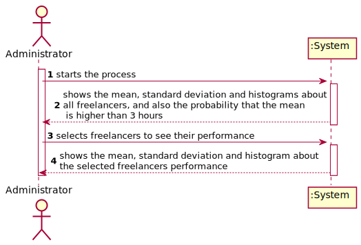
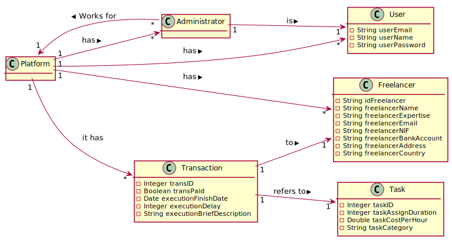
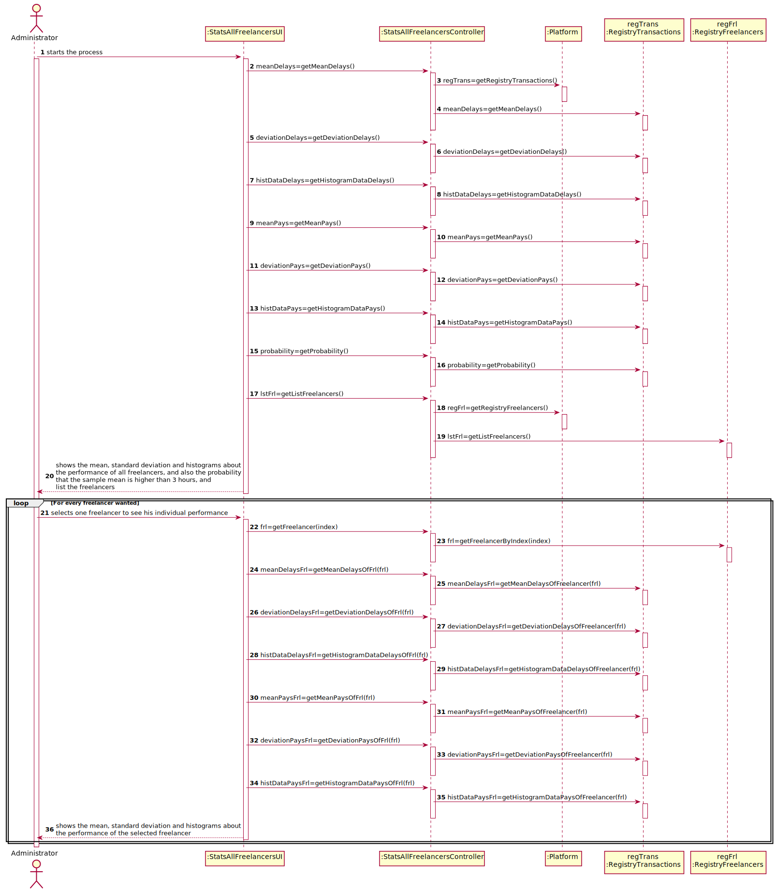
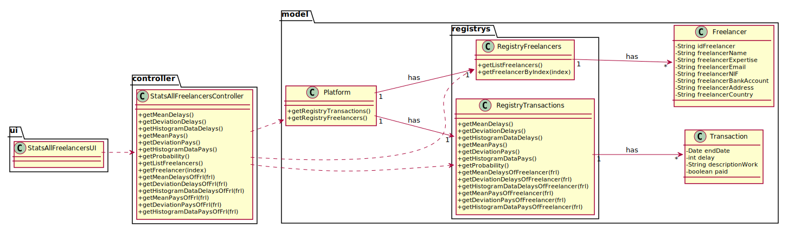

# UC8 - Statistics about System's Freelancers

## 1. Requirements Engineering

### Brief Format

The administrator starts the process to analyse freelancers' performance. The system shows the mean, standard deviation  and histograms about the performance of all freelancers and also the probability that the sample mean is higher than 3 hours. The administrator selects freelancers to see their individual performance. The system shows the mean, standard deviation and histogram about the selected freelancer performance.

### SSD

### Full Format

#### Main Actor

* Administrator

#### Stakeholders and their interests
* **Administrator** : Wants to see the quality of freelancers' work.
* **T4J** : Wants its administrators to analyse the quality of freelancers' work.

#### Preconditions

* There must be registered freelancers.

#### Post conditions

(n/a)

#### Main success scenario (or basic flow)

1. The administrator starts the process to analyse the performance of freelancers.
2. The system calculates and shows the mean, standard deviation and histograms about the performance of all freelancers and also the probability that the sample mean is higher than 3 hours. List the freelancers to choose.
3. The administrator selects one freelancer to see his individual performance.
4. The system calculates and shows the mean, standard deviation and histograms about the performance of the selected freelancer.
5. Steps 3 and 4 repeats for all freelancers wanted.

#### Extensions (or alternative flows)

*a. The administrator cancels the process.
>	The use case ends.

#### Special requirements
\-

#### List of Technologies and Data Variations
\-

#### Frequency of Occurrence
\-

#### Open questions

- 

## 2. OO Analysis

### Excerto do Modelo de Domínio Relevante para o UC

## 3. OO Design

### Racional

| Main Scenario | Question: Which class... | Answer  | Justification  |
|:--------------  |:---------------------- |:----------|:---------------------------- |
| 1. The administrator starts the process to analyse the performance of freelancers. | ... interacts with the user? | StatsAllFreelancersUI | Pure Fabrication |
|  | ... coordinates the UC? | StatsAllFreelancersController | Controller |
| 2. The system calculates and shows the mean, standard deviation and histograms about the performance of all freelancers and also the probability that the sample mean is higher than 3 hours. List the freelancers to choose. | ... calculates mean, standard deviation, histogram data of delays/payments and probability? | RegistryTransactions | IE: have all transactions. |
|  | ... knows RegistryTransactions? | Platform | IE: have RegistryTransactions (by HC+LC). |
|  | ... knows the data for the calculations? | Transaction | IE: knows its own data. |
|  | ... knows the Freelancers to list? | Platform | IE: have RegistryFreelancers (by HC+LC). |
|  |  | RegistryFreelancers | IE: have all Freelancers. |
| 3. The administrator selects one freelancer to see his individual performance. |  |  |  |
| 4. The system calculates and shows the mean, standard deviation and histograms about the performance of the selected freelancer. | ... calculates mean, standard deviation and histogram data of delays/payments? | RegistryTransactions | IE: have all transactions. |
|  | ... knows the data for the calculations? | Transaction | IE: knows its own data. |
| 5. Steps 3 and 4 repeats for all freelancers wanted. |  |  |  |

### Systematization ##

 From racional results the following software classes:

 * Platform
 * Transaction
 * Freelancer

Another classes (IE: Pure Fabrication) identified:  

 * StatsAllFreelancersUI
 * StatsAllFreelancersController
 * RegistryTransactions
 * RegistryFreelancers

###	Sequence Diagram

###	Class Diagram

