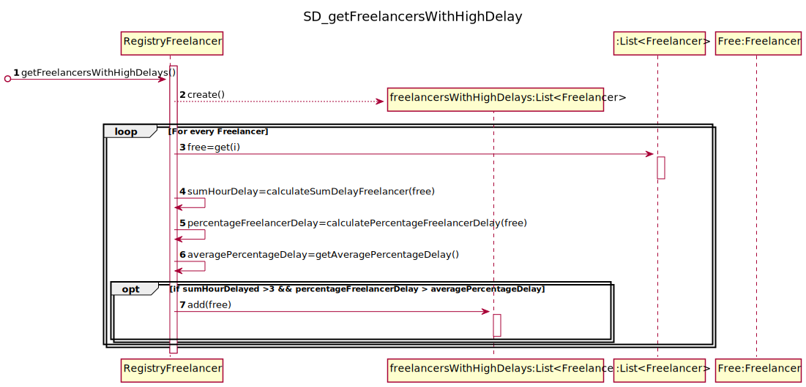

# UC9 - Automatic Email to Freelancers 

## 1. Requirements Engineering

### Brief Format
The timer begins the automatic process of sending an email to all Freelancers that have mean task delay time higher than 3 hours and percentage of delays that is higher than the overall percentage of delays during the current year.
The system sends all the emails necessary and terminates the process.

#### Main Actor

* Timer (Time)

#### Stakeholders and their interests

* **Freelancer** : Receives information about his performance during the current year.

#### Preconditions

* The platform has registered at least one Freelancer that have mean task delay time higher than 3 hours and percentage of delays that is higher than the overall percentage of delays during the current year.

#### Post conditions

* The freelancers that have the parameter's mentioned behind will receive an Email.

#### Main success scenario (or basic flow)

1. The timer begins the automatic process of sending emails ,when it reaches the last day of every year.
2. The system sends an email to all Freelancers that follow the defined parameter's and ends the process. 

#### Extensions (or alternative flows)   
 ** 2. The system does not have any Freelancer (during the current year) that have mean task delay higher than 3 hours and higher than average percentage of delays during the current year.
* > 
      > The use case ends
#### Special requirements
\-

#### List of Technologies and Data Variations
\-

#### Frequency of Occurrence
\-

#### Open questions
\-
* What should be included in the email to the Freelancer ?
## 2. OO Analysis.

### Excerpt from the Relevant Domain Model for UC

## 3. Design - Use Case Realization.

### Rational

| Main Flow | Question: What Class ... | Answer | Justification  |
|:--------------  |:---------------------- |:----------|:---------------------------- |
|1. The timer begins the automatic process of sending emails ,when it reaches the last day of every year. | ... coordinates the UC?| EndYearEmailTask |TimerTask |
| | ... create the timer? | RegistryFreelancers | creator: RegistryTransactions have all the freelancers needed. | 
| |...has RegistryFreelancers | Platform | IE: Platform has RegistryFreelancers. |
|  | ... identifies that time has been reached and starts the process? | Timer | Timer |
| |... responsible for the beginning of the process | Timer |IE:Timer begins the task when it reaches the designated time.|
|2.The system sends an email to all Freelancers that follow the defined parameter's.| 
| |...  knows the Freelancers eligible to send the email ? | RegistryFreelancers |IE: RegistryFreelancers knows the data about all Freelancers.|
| | ... knows of the delays made by a Freelancer | Transaction | IE: Transaction have data about the delays made by the freelancer.|
| | ... has the transactions | RegistryTransactions | IE: Has all transactions of the system | 
| | ... sends email to the freelancer? | ExternalEmailSender | Protected Variation. | 

### Systematization ##

It follows from the rational that the conceptual classes promoted to software classes are:
* Platform 
* Transaction
* Freelancer
Other software classes (i.e. Pure Fabrication) identified: 
* RegistryFreelancer
* ExternalEmailSender
###	Sequence Diagram

###	Class Diagram

